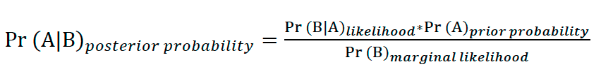
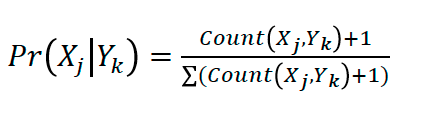

# Bayesian Inference and Naïve Bayes Classifier

Bayesian inference assumes that human learners keep updating their beliefs (represented as probabilities) on the basis of observed data and making inferences through the updated beliefs. The degree of belief for the current data (i.e., posterior probability) is computed jointly by the accumulated degree of conviction in a hypothesis before encountering the current observation (i.e., prior probability) and by a conditional probability where the current data would be observed if the hypothesis is true (i.e., likelihood) (Pearl and Russell, 2001; Perfors et al., 2011). 
Of the Bayesian inference based classifiers, the Naïve Bayes method is considered a simple, yet robust and efficient, technique for text classification (Domingos and Pazzani, 1997; Hand and Yu, 2001; Langley et al., 1992; Rish, 2001). This method assumes that features are independent of each other, suggesting that the operation of this model is based on conditional probabilities, formalised as (1).

## Naïve Bayes:

  </img>

The effectiveness of the Naïve Bayes classifier (and its modified versions) has been well established (e.g., Kim et al., 2006; Taheri et al., 2011; Yuan et al., 2012). One caveat inherent in this method is that, when any of the features becomes zero, the probability of that feature converges towards zero. To complement this point, various smoothing techniques have been devised such as Laplace smoothing (e.g., Agresti and Coull, 1998), Jelinek Mercer smoothing (e.g, Jelinek and Mercer, 1980), Dirichlet smoothing (e.g., MacKay and Peto, 1995), Absolute Discounting smoothing (e.g., Ney et al., 1994), and Two stage smoothing (e.g., Zhai and Lafferty, 2004). In this study, we adopted the Laplace smoothing: the Laplace estimator adds the value of 1 as the Laplace value to the original frequency value so that the probability of occurrence of each feature does not converge towards zero, formulated as (2).

##  Laplace estimator: 

  </img>

