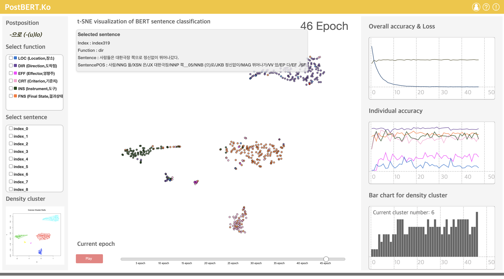

# PostBERT.Ko

<!--      -->
     

## Abstract
The present study introduces a BERT-based visualization system that interactively demonstrates how a BERT model simulates human interpretation of word-level polysemy involving an adverbial postposition <i>-(u)lo</i> in Korean. This system shows the classification performance of the BERT model that identifies the intended functions of <i>-(u)lo</i> per epoch. The system also shows how the model generates clusters of sentences on a two-dimensional, sentence-level embeddings with t-SNE. Our system reveals that the model performance gradually improves as the epoch proceeds, which is contrast to the traditional word-level embedding models.

### Screenshots
-----------

  

- [Try to use PostBERT.ko](https://seongmin-mun.github.io/Project/BERT%20polysemy%20interpretation_EACL/PostBERT.Ko-EACL/index.html)

### Skills
-------
Machine Learning & NLP & Statistics

- Computer Languages: Java, R, Python
- DataBase: MySQL, MongoDB
- Machine Learning: Word-Embedding (Singular Value Decomposition, Positive Pointwise Mutual Information), Sentence-Embedding (Bidirectional Encoder Representations from Transformers), t-SNE (t-Distributed Stochastic Neighbor Embedding)
- NLP-based methods: Dependency tagger, POS tagger, Pre-Processing (tokenization, lemmatization, N-gram, window size), etc.
- Statistics: Principal Component Analysis, Independence t-test, Correlation
- Tools: IntelliJ IDEA, RStudio, PyCharm, bitnami

Visualization Technique

- Visualization Method: Force directed graph, Distributional semantic map, Multi-line chart

Server (Back-end)

- Computer Languages: Java, Python, PHP
- DataBase: MySQL, MongoDB
- Libraries: Java (KKMA(org.snu.ids.ha), Eunjeon (org.bitbucket.eunjeon.seunjeon)), Python (numpy, sklearn, pandas, nltk, gensim, scipy)
- Tools: IntelliJ IDEA, PyCharm

Client (Front-end)

- Computer Languages: javascript (d3.js, jquery.js), html/css
- DataBase: json
- Tools: Atom, WebStorm
